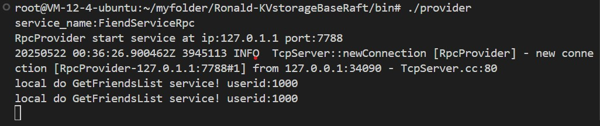
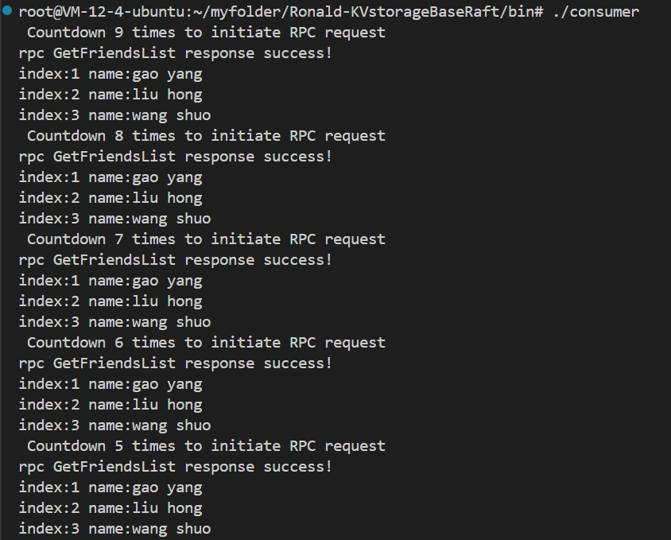
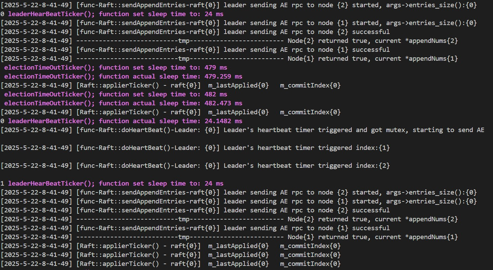
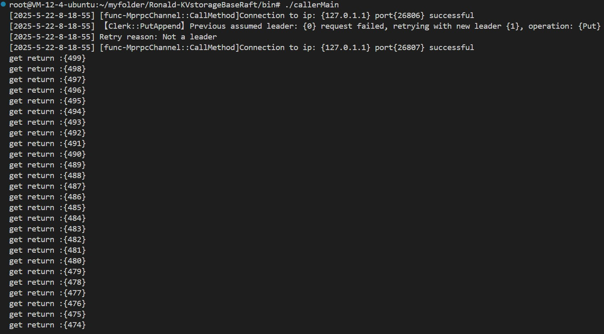

# Distributed Key-Value Store with Raft Consensus

A C++ implementation of a distributed key-value storage system based on the Raft consensus algorithm. This project demonstrates understanding of distributed systems principles and practical implementation of fault-tolerant consensus.

## Project Overview

This project implements a distributed key-value storage database using the Raft consensus protocol for strong consistency across nodes. It was developed as a learning project to understand the internals of distributed consensus and storage systems.

### Key Features

- **Raft Consensus Implementation**: Leader election, log replication, and safety mechanisms
- **Distributed Key-Value Storage**: Consistent data storage across multiple nodes
- **RPC Framework**: Custom RPC system built on the Muduo networking library
- **Fault Tolerance**: System remains operational despite node failures

### Technology Stack

- **C++11/14**: Core implementation language
- **Muduo**: High-performance network library
- **Protobuf**: Efficient serialization for RPC
- **Boost**: Utility libraries
- **CMake**: Build system

- clang-format:`sudo apt-get install clang-format`
- protoc: 3.12.4, ubuntu22 use`sudo apt-get install protobuf-compiler libprotobuf-dev`
- boost: `sudo apt-get install libboost-dev libboost-test-dev libboost-all-dev`
- Muduo: 
```bash
git clone https://github.com/chenshuo/muduo.git
cd muduo
```


## Branch Information

- **main**: Latest features with implemented client
- **rpc**: Focuses on the Muduo-based RPC framework
- **raft_DB**: Key-value database with observable Raft election process

## Building and Running

### Prerequisites

- Muduo networking library
- Boost libraries
- Protocol Buffers (protoc v3.12.4)
- CMake 3.10+
- clang-format (optional)

### Compilation

```bash
cd Ronald-KVstorageBaseRaft
mkdir cmake-build-debug
cd cmake-build-debug
cmake ..
make
```

### Running the RPC Framework

First terminal:
```bash
./provider
```


Second terminal:
```bash
./consumer
```


### Running the Raft Cluster

```bash
# Ensure you're in the bin directory with test.conf file
./raftCoreRun -n 3 -f test.conf
```

When running correctly, the console will display Raft logs showing server initialization, leader election, and heartbeat messages demonstrating the consensus algorithm in action.

### Using the Key-Value Store

After starting the Raft cluster, launch the client:
```bash
./callerMain
```


## Implementation Highlights

- **Raft Protocol**: Fully implemented with leader election, log replication, and term-based consensus
- **State Machine Replication**: Ensures consistency across distributed nodes
- **Modular Design**: Separation of consensus, storage, and networking components

## Future Improvements

- [Done] Complete Raft cluster functionality
- [ ] Remove redundant dependencies (Muduo, Boost)
- [ ] Code optimization and refinement
- [Done] Code formatting standardization
- [ ] Comprehensive documentation

## Learning Outcomes

This project demonstrates proficiency in:
- Distributed systems architecture
- Consensus algorithms
- Network programming
- C++ systems programming
- Fault-tolerant design


## todoList

- [Done] Complete Raft node cluster functionality
- [ ] Remove redundant libraries: muduo, boost
- [ ] Optimize and simplify code
- [Done] Code format
- [ ] Code documentation/explanation maybe


